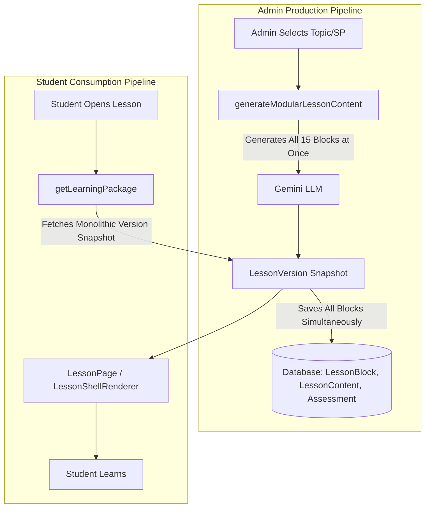
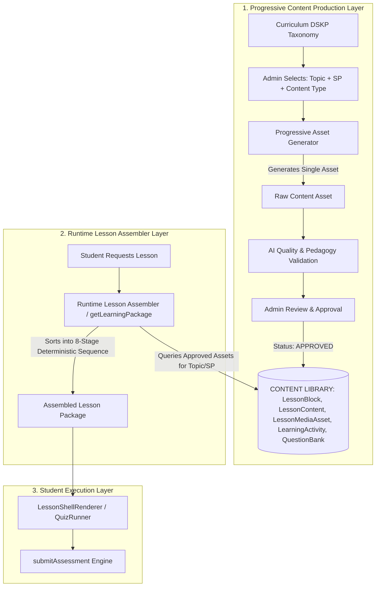

# CONTENT LIBRARY ARCHITECTURE AUDIT

This document contrasts StudyQuest's **CURRENT** monolithic lesson package architecture against the **PROPOSED** progressive Content Library Architecture.

---

## 1. CURRENT ARCHITECTURE (Monolithic Package Generation)

Currently, content generation and consumption follow a single-pass, monolithic pipeline:

### Limitations of Current Model
1. **All-or-Nothing Generation**: Admin must generate an entire 15-block lesson package in one heavy API call.
2. **Hard to Update Specific Components**: Updating a single video or adding an interactive widget requires modifying the entire `LessonVersion`.
3. **No Progressive Asset Approval**: Content cannot be produced item-by-item (e.g. producing 5 videos across a subject first, then 10 quizzes).

---

## 2. PROPOSED ARCHITECTURE (Progressive Content Library & Runtime Assembly)

The proposed architecture decouples content asset production from lesson assembly:

---

## 3. AUDIT OF SPECIFIC SYSTEM DOMAINS

### Domain 1: Database Entities & Schemas
- **Finding**: Base44 entities already exist for every asset category:
  - Text/Markdown/Worked Examples -> `LessonBlock` / `LessonContent`
  - Video/Media Assets -> `LessonMediaAsset` / `LessonContent` (`content_type: "video"`)
  - Interactive Widgets -> `LearningActivity`
  - Quizzes & Assessments -> `Assessment`, `QuestionBank`, `QuestionOption`
  - Visuals/Infographics -> `LessonMediaAsset`
  - Flashcards -> `Flashcard`
- **Reusability**: **100% High**. Making `lesson_version_id` optional is the only schema modification needed.

### Domain 2: Curriculum Tagging
- **Finding**: Structured curriculum entities already exist: `Curriculum`, `CurriculumStandard`, `Subject`, `Topic`, `Subtopic`, `Level`.
- **Fields**: Entities already support `subject_id`, `topic_id`, `subtopic_id`, `sp_code`, `sk_code`, `learning_standard_id`, `tp_code`. No free-text tagging is required.

### Domain 3: Status & Approval Lifecycle
- **Finding**: Existing status fields across entities support the full lifecycle:
  - `created_source`: `manual` | `ai_generated`
  - `status`: `draft` | `published` | `archived`
  - `review_status`: `draft` | `review` | `approved` | `published` | `archived`
  - `preview_status`: `NOT_VIEWED` | `VIEWED` | `APPROVED`
  - `approved_by`: Admin User ID
  - `approved_at`: Timestamp
- **Conclusion**: The status lifecycle `GENERATED` → `UNDER_REVIEW` → `APPROVED` → `PUBLISHED` → `ARCHIVED` is fully supported by existing fields.

### Domain 4: Versioning
- **Finding**: `LessonVersion` handles snapshot versioning with `version_number`, `quality_score`, `published_at`.
- **Asset Versioning**: Assets can be queried by `approved_at` / timestamp or version number without mutating existing published snapshots.

### Domain 5: Admin UI Components
- **Finding**: Admin UI contains reusable modular components:
  - [AdminContentStudio.jsx](file:///c:/Users/sanil/OneDrive/Desktop/studyquest-ai-1/src/components/admin/AdminContentStudio.jsx) (Studio layout)
  - [UniversalLessonPreview.jsx](file:///c:/Users/sanil/OneDrive/Desktop/studyquest-ai-1/src/components/admin/UniversalLessonPreview.jsx) (Live preview)
  - [AIQualityScorecard.jsx](file:///c:/Users/sanil/OneDrive/Desktop/studyquest-ai-1/src/components/admin/AIQualityScorecard.jsx) (Quality verification)
- **Conclusion**: No need to rebuild the admin studio from scratch; only add asset-type selection filters.

### Domain 6: Video Storage
- **Finding**: Video assets are stored in `LessonContent` (`content_type: "video"`, `media_url`, `voice_script`) and `LessonMediaAsset`. Adding `topic_id` / `sp_code` tags makes them reusable across any lesson in the topic.

### Domain 7: Interactive Content
- **Finding**: Driven by [widgetRegistry.js](file:///c:/Users/sanil/OneDrive/Desktop/studyquest-ai-1/src/services/widgetRegistry.js) (10 interactive widgets: `base_ten_blocks`, `sentence_builder`, `fraction_slicer`, `number_scale`, `money_counter`, `clock_face`, `shape_sorter`, `piktograf`, etc.) stored in `LearningActivity` (`activity_data_json`).
- **Conclusion**: Readily functions as reusable `InteractiveContentAsset`.

### Domain 8: Assessment & Question Bank
- **Finding**: `Assessment`, `QuestionBank`, and `QuestionOption` already operate as a decoupled question library. Questions are tagged with `topic_id`, `sp_code`, `difficulty`, `cognitive_level`, and `status`.

### Domain 9: Runtime Assembly
- **Finding**: [getLearningPackage/entry.ts](file:///c:/Users/sanil/OneDrive/Desktop/studyquest-ai-1/base44/functions/getLearningPackage/entry.ts) already fetches content, blocks, flashcards, activities, guides, explanations, and assessments in parallel, sorting them sequentially into `content_blocks`.
- **Adaptation Effort**: Low. Simply add a fallback query in `getLearningPackage` to select approved library assets when no fixed version ID is specified.
