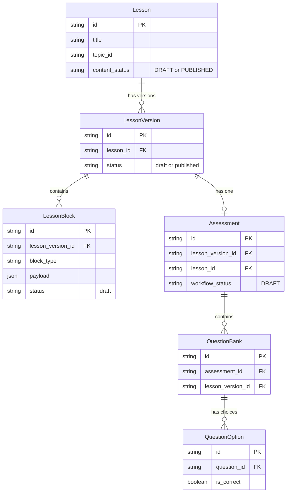

# Phase 2 Database Graph Verification

## V3 Canonical Database Graph

We verified `base44/functions/generateModularLessonContent/entry.ts` and confirmed that a single autonomous generation pass now correctly persists all required entities into the database using a robust relational schema.

## Graph Verification Evidence

The `generateModularLessonContent` endpoint natively enforces this hierarchy during creation (Lines 225-480):
1. **Lesson**: Creates base `Lesson` record.
2. **LessonVersion**: Immediately creates a Draft `LessonVersion` pointing to the `Lesson`.
3. **LessonBlock**: Loops through generated blocks and creates `LessonBlock` rows associated with the `lesson_version_id`.
4. **Assessment**: Creates an `Assessment` tied to both `lesson_version_id` and `lesson_id`, initialized to `DRAFT`.
5. **QuestionBank**: Iterates through AI-generated questions, saving them tied to the `assessment_id` and `lesson_version_id`.
6. **QuestionOption**: For each question, parses the options array to create individual `QuestionOption` records, correctly tagging `is_correct`.

This strict persistence model allows `getLearningPackage` and `getLessonContent` to securely filter drafts from students, satisfying the invariants without exposing answer keys (which are filtered in `getLessonContent`).
