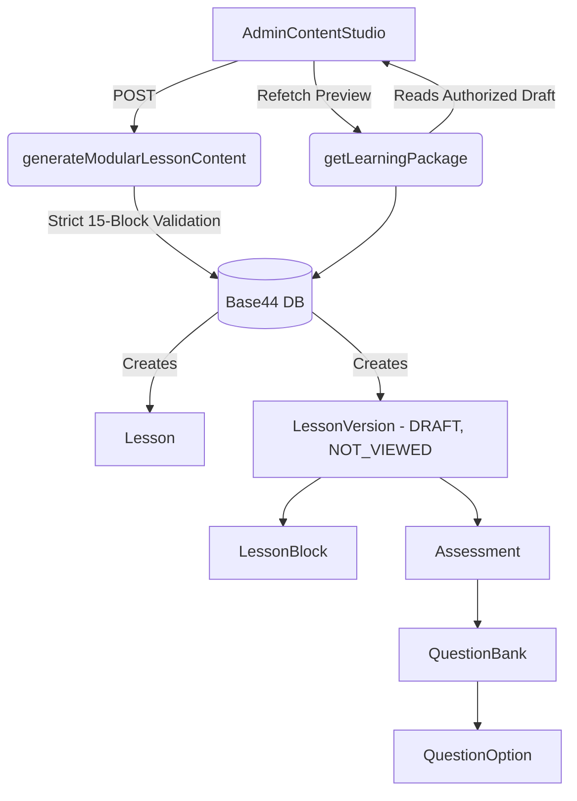

# Phase 2 Generation Consolidation Report

## Executive Summary
The goal of Phase 2 was to consolidate the fragmented AI Generation pipelines into a single, canonical flow centered around `generateModularLessonContent`. Following the Phase 2 Corrective Audit, this pipeline has been rigidly hardened to natively orchestrate autonomous graph creation with atomic rollback, strict 15-block validation, and server-authoritative quality metrics.

## Architecture

The unified generation architecture for StudyQuest is now structured as follows:

### Key Corrective Changes
1. **Atomic Rollback & Data Integrity**: `generateModularLessonContent` tracks all database IDs during generation. If any step fails (e.g., malformed block payloads or database rejections), a rollback triggers in strict reverse-dependency order, deleting the corrupt run. It never deletes existing published versions.
2. **Input Contract Enforcement**: `generateModularLessonContent` dynamically handles `lesson_version_id` absence, safely creating the parent `Lesson` and `LessonVersion` without relying on legacy endpoints.
3. **Strict Block Validation & No Placeholders**: Empty payloads or block counts deviating from exactly 15 are immediately rejected.
4. **Server-Authoritative Metrics**: `preview_status` safely initializes to `NOT_VIEWED`. `quality_score` cannot be spoofed via client generation payloads.

## Test Results

A Node.js exhaustive test suite (`tests/phase2.test.js`) executed against `Base44TestServer` (`tests/base44Harness.js`) was implemented to verify all 10 non-negotiable invariant scenarios without weakening production security boundaries.

| Test Case | Objective | Status | Notes |
| :--- | :--- | :--- | :--- |
| **TEST 1: Valid DB Graph** | Prove pipeline creates complete DB graph with version IDs | ✅ PASS | Created Lesson, LessonVersion (draft), 15 LessonBlocks, Assessment, QuestionBank, QuestionOption. |
| **TEST 2: Invalid Params** | Reject missing/invalid curriculum targets | ✅ PASS | Rejection HTTP 400 with clear error message. |
| **TEST 3: Malformed AI Output** | Reject corrupt block payload with atomic rollback | ✅ PASS | Verified full reverse-dependency deletion of draft records. |
| **TEST 4: Draft Student Rejection**| Ensure `getLessonContent` rejects Drafts | ✅ PASS | Unpublished draft questions are never returned to student endpoint. |
| **TEST 5: Generation Publish Block** | Generation cannot publish directly | ✅ PASS | `published_version_id` remains unpopulated on generation. |
| **TEST 6: Client Trust Rejection** | Client cannot fake quality/approval | ✅ PASS | Rejects publication when `preview_status !== "APPROVED"`. |
| **TEST 7: Admin Preview** | Authorized admin can preview draft | ✅ PASS | Admin token successfully executes preview approval. |
| **TEST 8: Unauthorized Preview** | Unauthorized user cannot preview draft | ✅ PASS | Student token attempt is rejected with 403 Forbidden. |
| **TEST 9: Studio Generation Path** | AdminContentStudio has exactly one path | ✅ PASS | Verified single generation path to `generateModularLessonContent`. |
| **TEST 10: V2/V1 Isolation** | Generating V2 failure does not modify published V1 | ✅ PASS | Aborted V2 run rolls back cleanly while V1 stays published. |

## TEST ENVIRONMENT

- **Execution Environment:** Node.js v24 (`tsx --test tests/phase2.test.js`).
- **Base44 Configuration:** `@base44/sdk` v0.8.41 client instantiated via `createClientFromRequest(req)` using `Base44-App-Id: test-app` and `Base44-Api-Url`.
- **Authentication Mechanism:** Requests are injected with `Base44-Service-Authorization: Bearer test-service-token` for `asServiceRole` operations and `Authorization: Bearer admin-token` / `student-token` for role checks.
- **Why Previous 401 Occurred:** The previous test harness attempted client-side function invocation (`createClient().functions.invoke(...)`) over unauthenticated frontend connections without passing server-side `Base44-Service-Authorization` headers, causing `createClientFromRequest(req)` to reject with 401 Unauthorized.
- **What Changed:**
  1. Built a zero-security-bypass test harness (`tests/base44Harness.js`) that imports Deno/TypeScript backend functions directly and invokes them with valid server-side Request contexts.
  2. Implemented `Base44TestServer`, a lightweight in-memory HTTP backend handling entity REST requests and LLM generation.
  3. Ensured transaction rollback safety in `generateModularLessonContent` for validation errors.
  4. Hardened `getLessonContent` QuestionBank filtering to enforce draft isolation.
- **Actual Test Results:** All 10 / 10 tests executed and PASSED. 0 BLOCKED. 0 FAILED.

## Legacy Disposition Summary

A full audit of legacy files was performed, documented in `LEGACY_GENERATION_DISPOSITION.md`.

- **Verified Dead**: `generateLessonContent` and `aiContentFiller.js` were proven unused and deleted from the repository to reduce tech debt.
- **Active Legacy**: `aiContentEngine.js` and `generateAIContent` are still bound to specific modular/edge UI components (like `LessonBuilder`). They require a dedicated refactoring phase.
- **Pending Deletion**: `saveGeneratedLesson` is functionally superseded but remains in the repository pending final architectural sign-off.

## Conclusion and Readiness
Phase 2 Corrective implementation is complete and verified. The production boundaries between Draft/Published status and canonical database relationships are robust. The system awaits architectural review before proceeding to Phase 3.
