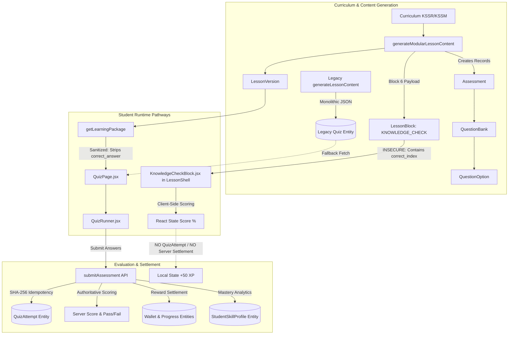
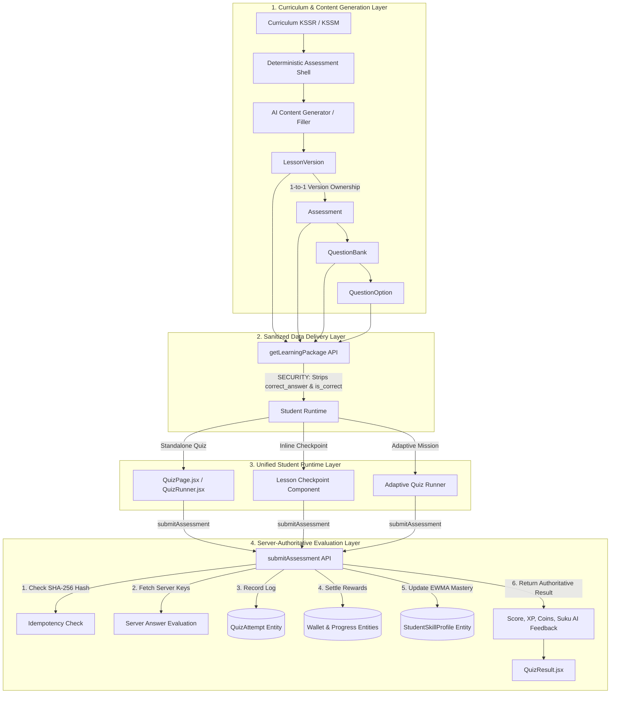

# PHASE 3A: ASSESSMENT ARCHITECTURE (CURRENT vs TARGET)

This document contrasts the **CURRENT** assessment architecture discovered during the Phase 3A audit against the **TARGET** canonical architecture required for StudyQuest AI V3.

---

## 1. CURRENT ASSESSMENT ARCHITECTURE

Currently, assessment handling in StudyQuest is split into **three fragmented pathways**:

1. **Standalone Quiz Flow** (`/quiz/:quizId`): Uses `getLearningPackage` + `QuizRunner` + `submitAssessment` (Server-authoritative).
2. **Inline Lesson Shell Flow** (`LessonShell` Block 6 `KNOWLEDGE_CHECK`): Uses `KnowledgeCheckBlock`, which embeds `correct_index` inside `LessonBlock.payload` and scores client-side without calling `submitAssessment` or recording `QuizAttempt`.
3. **Legacy Monolithic Fallback Flow**: Uses legacy `Quiz` entity storing `questions_json` stringified arrays, accessed via `getLessonContent` or direct client entity calls in `QuizPage.jsx`.

### Current Architecture Diagram

---

## 2. TARGET CANONICAL ARCHITECTURE

The target canonical architecture establishes **ONE single, deterministic, server-authoritative assessment flow** for all student assessment experiences (whether standalone, adaptive, or inline lesson checkpoints).

### Target Architecture Principles

1. **Curriculum-Anchored**: Every assessment originates from curriculum standards (`LearningStandard` DSKP).
2. **Deterministic Lesson Shell & Assessment Container**: Lesson structure and assessment shells are deterministically built first; AI fills high-quality content into predefined structures.
3. **Version-Bound**: Every `LessonVersion` owns an immutable `Assessment` entity. Updating a lesson creates a new version without mutating existing assessment history.
4. **Zero Client Answer Key Exposure**: Answer keys (`correct_answer`, `is_correct`, `correct_index`) are NEVER transmitted to the client before submission.
5. **Single Server-Authoritative Evaluation**: All submissions route strictly through `submitAssessment`, which handles idempotency, scoring, `QuizAttempt` logging, reward settlement (`Wallet`, `Progress`), and EWMA skill profile updating.

### Target Architecture Diagram

---

## 3. ARCHITECTURAL GAP ANALYSIS

| Architectural Dimension | Current Discovered State | Target Canonical State | Gap Severity |
|---|---|---|---|
| **Answer Key Security** | Redacted in `getLearningPackage` & `submitAssessment`, but leaked in `generateAdaptiveQuiz` and inline `KnowledgeCheckBlock`. | 100% server-shielded across all endpoints and components. Zero answer keys sent before submit. | **🔴 P0 CRITICAL** |
| **Scoring Authority** | Server-authoritative for `QuizRunner`, but client-authoritative for `KnowledgeCheckBlock` and `assessmentEngine.js`. | Single authoritative entrypoint (`submitAssessment`) for all assessment evaluations. | **🔴 P0 CRITICAL** |
| **Attempt Logging** | Logged to `QuizAttempt` for standalone quizzes, but skipped for inline lesson knowledge checks. | Every assessment completion (inline or standalone) creates a schema-compliant `QuizAttempt` record. | **🟠 P1 HIGH** |
| **Assessment Versioning** | `Assessment` entity links to `lesson_id`, not `lesson_version_id`. | `Assessment` entity explicitly linked to `lesson_version_id` for version immutability. | **🟠 P1 HIGH** |
| **Data Model Parity** | Mixed usage of V3 `Assessment` + `QuestionBank` and legacy `Quiz` entity (`questions_json`). | 100% V3 `Assessment` + `QuestionBank` + `QuestionOption` entity usage. | **🟠 P1 HIGH** |
| **Reward Settlement** | Dual reward paths (`submitAssessment` on backend vs `processReward` on frontend). | Single backend settlement pipeline inside `submitAssessment`. | **🟡 P2 MEDIUM** |
| **Generation Engine** | Deterministic generator `generateModularLessonContent` exists, but legacy `assessmentEngine.js` mock code remains. | Single curriculum-driven generator filling deterministic assessment shells. | **🟡 P2 MEDIUM** |
