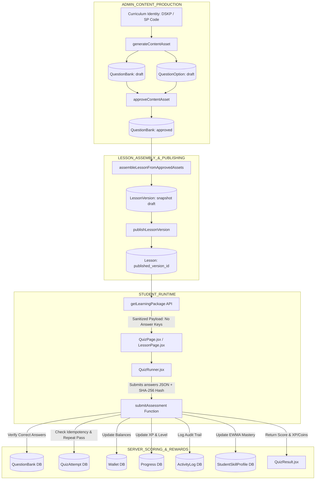

# PHASE 4A: QUIZ & ASSESSMENT DEPENDENCY GRAPH

This document presents the complete component and data dependency graph for the assessment and quiz subsystem in StudyQuest AI.

---

## 1. CANONICAL PRODUCTION ARCHITECTURE GRAPH



---

## 2. LEGACY / PROTOTYPE COMPONENT DEPENDENCIES

```text
[Legacy Prototype Flow]
diagnosticAssessmentService.js / assessmentEngine.js
      │
      ▼
Client-Side Question Generator (Hardcoded questionTemplates.json)
      │
      ▼
TopicMasteryPlayer.jsx / DiagnosticAssessment.jsx
      │
      ▼
Local Component State Scoring (Deprecated in Canonical Production)
```

---

## 3. DEPENDENCY CLASSIFICATION

1. **Canonical Production Pipeline**:
   - `base44/functions/generateContentAsset/entry.ts`
   - `base44/functions/approveContentAsset/entry.ts`
   - `base44/functions/assembleLessonFromApprovedAssets/entry.ts`
   - `base44/functions/publishLessonVersion/entry.ts`
   - `base44/functions/getLearningPackage/entry.ts`
   - `base44/functions/submitAssessment/entry.ts`
   - `src/components/quiz/QuizRunner.jsx`
   - `src/components/quiz/QuizResult.jsx`

2. **Active Legacy / Prototype Compatibility**:
   - `src/services/assessmentEngine.js`
   - `src/services/diagnosticAssessmentService.js`
   - `src/lib/diagnosticQuestionBank.js`
