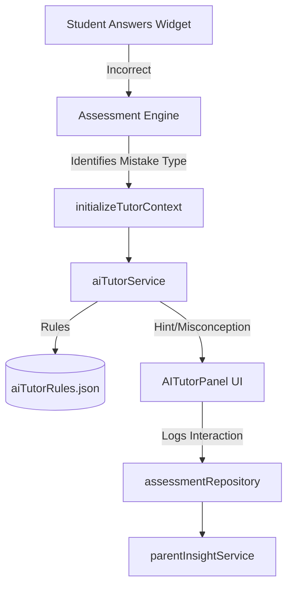

# AI Tutor Engine (Phase 6)

## Overview
The AI Tutor Engine introduces a real-time, in-lesson coaching layer. Unlike traditional systems that immediately mark answers as "Wrong!" and reveal the solution, the AI Tutor uses progressive hints, conceptual explanations adapted to the student's age (Tahun), and specific pedagogical feedback to guide the student toward the answer.

## Architecture

## Progressive Hint Logic
When a student requests a hint:
- **Level 1**: Broad hint ("Let's look at tens and ones separately").
- **Level 2**: Focused hint ("How many tens are in 23?").
- **Level 3**: Explicit but non-revealing hint ("Try adding the tens first, then the ones").

## Contextual Explanations
Explanations are dynamically constructed based on the student's `yearLevel`:
- **Tahap 1 (Tahun 1-3)**: Uses visual metaphors (e.g., "blocks", "pizza slices", "toys").
- **Tahap 2 (Tahun 4-6)**: Uses reasoning, formulas, and KBAT logic.

## Parent Insights Integration
If a student relies heavily on the AI Tutor (e.g., requesting hints frequently), the `assessmentRepository` logs these interactions. The `parentInsightService` translates this into meaningful advice for the parent:
> "Anak kerap menggunakan bantuan AI Tutor. Mereka mungkin memerlukan lebih banyak bantuan visual semasa memahami konsep."
