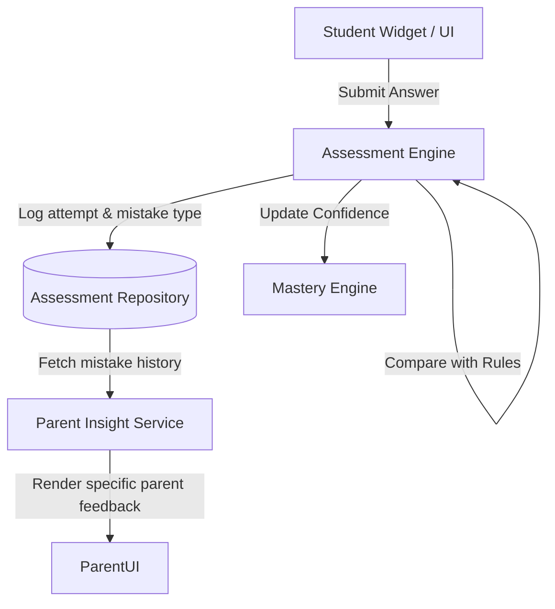

# Assessment Intelligence Engine

The Assessment Engine transforms StudyQuest from a basic teaching application into a deep pedagogical measurement system. It does not just score a student's answer as "Correct" or "Wrong"; it analyzes *why* the student got it wrong.

## Architecture

## Features

### 1. Conceptual Mistake Analysis
Using `assessmentRules.json`, the engine compares the student's answer against known distractors (traps). 
For example, in Fraction Addition:
- Correct formula: `(num1 + num2) / den`
- Distractor 1: `(num1 + num2) / (den + den)` -> **DENOMINATOR_ADDITION** (Conceptual Error)
- Distractor 2: `(num1 * num2) / den` -> **CONFUSED_OPERATOR** (Careless Error)

### 2. Adaptive Difficulty
The engine tracks consecutive success or failure via `adjustDifficulty()`, smoothly ramping from `BEGINNER` to `KBAT` (Higher Order Thinking Skills).

### 3. Parent Connectivity
Parents no longer see vague scores like "40%". Because the Assessment Engine logs the exact `mistakeType` into the `assessmentRepository`, the `parentInsightService` translates this into actionable coaching advice:
*"Anak anda cuba menambah pecahan, tetapi tersilap menambah bahagian bawah. Mereka perlukan peringatan tentang hukum pecahan asas."*

## Data Flow (Action to Recommendation)
1. Student answers incorrectly (Trap: Denominator Addition).
2. `AssessmentEngine` tags attempt with `mistakeType: DENOMINATOR_ADDITION`.
3. `MasteryEngine` lowers confidence for the SP.
4. `AssessmentEngine` detects `severity: HIGH` and queues a **Targeted Revision**.
5. `RecommendationEngine` routes the student to a foundational fraction widget tomorrow.
6. `ParentInsightService` shows the exact mistake to the parent on the dashboard.
