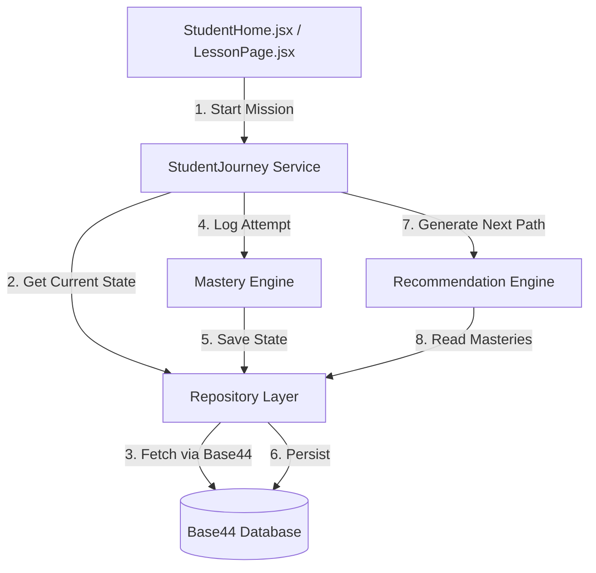

# Base44 Database Persistence Strategy

This document outlines the Phase 2 architectural transition from an in-memory intelligence engine to a persistent Base44 database structure.

## Architectural Changes

1. **Repository Pattern Added**: React components no longer interact with synchronous mockup data. They call `studentJourneyService` which now heavily utilizes `async/await` to pull from the new `src/services/database/` repository layer.
2. **Decoupled Engines**: The Recommendation Engine and Mastery Engine remain pure logic, but their state is now fetched/saved via Repositories, ready to be wired directly to Base44 SDK clients in the future.

## Base44 Entities

### 1. `Student`
Represents the core user.
```jsonc
{
  "id": "stu_123",
  "name": "Amir",
  "year_level": "Tahun 1",
  "curriculum": "KSSR_SEMAKAN",
  "created_at": "2026-08-02T12:00:00Z",
  "last_active": "2026-08-02T12:05:00Z"
}
```

### 2. `StudentProfile`
Aggregated top-level stats for the HUD.
```jsonc
{
  "student_id": "stu_123",
  "current_level": "KSSR_SEMAKAN_Tahun 1",
  "xp": 150,
  "streak": 3,
  "learning_status": "ACTIVE"
}
```

### 3. `DiagnosticAttempt`
Stores the results of onboarding placements.
```jsonc
{
  "student_id": "stu_123",
  "assessment_id": "diag_math_y1",
  "subject": "Matematik",
  "score": 85,
  "completed_at": "2026-08-02T12:02:00Z",
  "result_payload": "{ ... }" // Stores specific answers to recreate pathing later
}
```

### 4. `StudentMastery`
The core driver of the Recommendation Engine.
```jsonc
{
  "student_id": "stu_123",
  "sp_code": "1.1.1",
  "mastery_percentage": 100,
  "confidence_level": 0.9,
  "attempts": 2,
  "time_spent": 120, // seconds
  "status": "MASTERED",
  "updated_at": "2026-08-02T12:15:00Z"
}
```

### 5. `MissionProgress`
Mission logs tracking daily history.
```jsonc
{
  "student_id": "stu_123",
  "mission_id": "mis_456",
  "lesson_id": "les_base_10",
  "completed": true,
  "score": 100,
  "xp_earned": 50,
  "completed_at": "2026-08-02T12:20:00Z"
}
```

### 6. `StudentRecommendation`
Logs what the engine *thought* the student should do, useful for AI analysis later.
```jsonc
{
  "student_id": "stu_123",
  "recommended_sp": "1.1.2",
  "mission_type": "LEARNING",
  "priority": 1,
  "generated_at": "2026-08-02T12:20:01Z"
}
```

## Data Flow Diagram



## Next Steps
With the Database Persistence abstraction successfully integrated via async functions, the frontend remains fully operational and feels instantaneous, while structurally preparing the app to execute queries against the Parent Dashboard natively.
