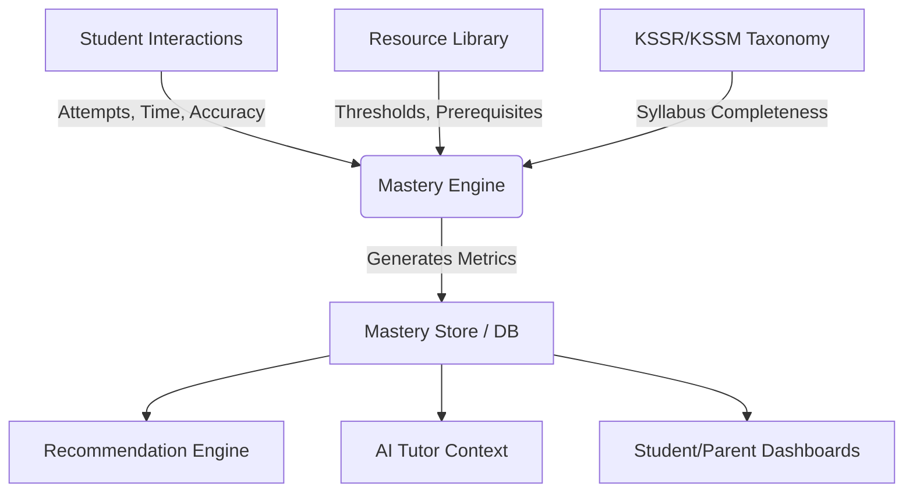

# StudyQuest Mastery Engine Architecture

The Student Mastery Engine is the intelligence layer of the StudyQuest platform. It operates securely on top of the Resource Library and Taxonomy services. Its sole purpose is to quantitatively track, assess, and predict a student's proficiency at the atomic Standard Pembelajaran (SP) level.

## 1. Architecture Flow



## 2. Data Model (`masterySchema.json`)

The engine maintains a strict schema for every SP a student interacts with.

- **Identifiers**: `student_id`, `sp_code`
- **Quantitative Metrics**: `mastery_percentage`, `attempts`, `correct_answers`, `incorrect_answers`, `average_score`, `time_spent`
- **Qualitative Metrics**: `confidence_level` (LOW, MEDIUM, HIGH), `streak`, `current_status` (NOT_STARTED, LEARNING, REVIEW_REQUIRED, MASTERED, EXCELLENT)
- **Dynamic Routing**: `recommended_revision`, `recommended_next`

## 3. Service API (`masteryEngine.js`)

A decoupled, deterministic service layer for recording and querying mastery metrics.

### Core Mutations
- `initializeStudentMastery(studentId, spCode)`: Scaffolds a new tracking node.
- `recordAttempt(studentId, spCode, isCorrect, timeSpent)`: The primary hook for widgets, quizzes, and assessments. Automatically recalculates all downstream metrics (streaks, confidence, status).
- `updateMastery(studentId, spCode, data)`: Override function for database syncing.

### Internal Logic Engines
- `calculateMastery(record)`: The core algorithm weighing correct answers against total attempts and evaluating against the SP's specific `mastery_threshold`.
- `calculateConfidence(percentage, streak)`: Evaluates consistency (streaks) against raw accuracy.

### Query Hooks
- `getMastery(studentId, spCode)`: Retrieve the atomic record.
- `getWeakSPs(studentId)`: Returns all nodes stuck in `REVIEW_REQUIRED`.
- `getStrongSPs(studentId)`: Returns all `MASTERED` or `EXCELLENT` nodes.
- `getRecommendedRevisionForStudent(studentId)`: Aggregates prerequisites from weak SPs.
- `getRecommendedNextForStudent(studentId)`: Aggregates next-steps from strong SPs.

### Aggregation Hooks
- `getOverallProgress(studentId)`: High-level overview of interacted SPs.
- `getSubjectProgress(studentId, subject)`: Subject-specific mastery rate.
- `getYearProgress(studentId, framework, grade, subjectId)`: Calculates completion against the absolute syllabus (Taxonomy Catalog).

## 4. Example Usage

```javascript
import { recordAttempt, getYearProgress, getRecommendedRevisionForStudent } from '@/services/masteryEngine';

// 1. A student successfully completes a BaseTenBlocksWidget for 1.4.1 (took 45 seconds)
const updatedRecord = recordAttempt('student_123', '1.4.1', true, 45);
/* 
  Returns:
  {
    sp_code: '1.4.1',
    mastery_percentage: 100,
    streak: 1,
    current_status: 'MASTERED',
    ...
  }
*/

// 2. A student fails a quiz question multiple times
recordAttempt('student_123', '1.4.2', false, 15);
recordAttempt('student_123', '1.4.2', false, 20);
recordAttempt('student_123', '1.4.2', false, 10);
recordAttempt('student_123', '1.4.2', false, 12); // attempts > 3, score < 60%

// 3. AI dynamically detects the struggle
const revisionPaths = getRecommendedRevisionForStudent('student_123');
// Engine automatically queries the Resource Library and returns ["1.4.1"] (the prerequisite)

// 4. Dashboard calculates absolute DSKP completion
const progress = getYearProgress('student_123', 'KSSR_SEMAKAN', 'Tahun 1', 'Matematik');
// Returns { totalInSyllabus: 3, mastered: 1, percentage: 33 }
```

## 5. Future Integration Points

The Mastery Engine is the foundation for autonomous intelligence:
1. **Recommendation Engine**: Will poll `getWeakSPs()` and `getRecommendedRevisionForStudent()` to automatically generate weekly adaptive study plans.
2. **AI Tutor**: Will inject `confidence_level` and `current_status` into the LLM prompt. A `LOW` confidence student gets more hints; an `EXCELLENT` student gets challenged.
3. **Dashboards**: Heatmaps will color-code the syllabus based on `current_status`.
