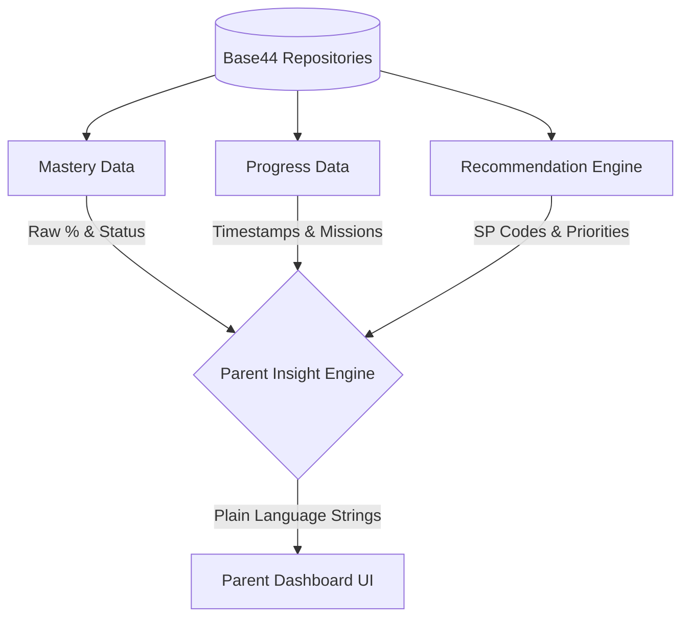

# Parent Insight Engine & Dashboard Architecture

This phase transformed StudyQuest from a standalone student app into a family learning ecosystem. We created a translation layer (the Insight Engine) that turns technical DSKP backend metrics into actionable, parent-friendly summaries.

## Architectural Flow

## The Translation Engine (`parentInsightService.js`)

Parents do not need to see "SP 1.1.2 - MASTERED". They need to see "Amir kelihatan sangat yakin dengan Operasi Asas Matematik." 

The Insight Engine achieves this through specific translation functions:
1. **`getLearningStrengths()`**: Maps high mastery to positive reinforcement tags.
2. **`getImprovementAreas()`**: Maps low confidence or failed attempts to constructive guidance tags.
3. **`getWeeklyLearningSummary()`**: Aggregates timestamps into "Missions Completed" and "Time Spent".
4. **`getParentRecommendations()`**: Re-routes the child's `Recommendation Engine` output directly into actionable Parent steps (e.g. "Luangkan 15 minit untuk berlatih...").

## String Mapping (`parentInsightRules.json`)

To keep the logic decoupled from the language, all parent-facing sentences are stored in a rules JSON file. This allows non-technical educators to adjust the tone of the AI coaching without touching React code, and naturally supports future localization.

## Component Structure

The Parent Dashboard is modularized into distinct, single-responsibility cards:
- **`ChildProgressCard`**: The hero overview.
- **`RecommendationCard`**: The AI action plan.
- **`StrengthCard` / `ImprovementCard`**: Qualitative feedback.
- **`WeeklyReportCard`**: Quantitative feedback.
