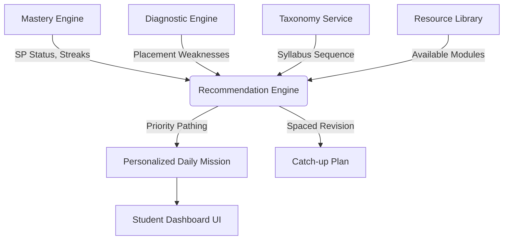

# StudyQuest Recommendation Engine Architecture

The Recommendation Engine is the autonomous brain of StudyQuest. It operates at the top of the logic stack, ingesting deterministic signals from the Mastery Engine and Taxonomy Service to formulate dynamic learning paths.

## 1. Architecture Flow



## 2. Priority & Rule Enforcement (`recommendationRules.json`)

The engine never picks lessons randomly. It strictly adheres to rule-based prioritization:
1. **MISSING_PREREQUISITE** (Weight: 100): The engine completely halts forward progression if a critical dependency is broken.
2. **REVIEW_REQUIRED** (Weight: 80): Overrides new learning if the student's mastery percentage has decayed below the threshold.
3. **LEARNING** (Weight: 60): Continues the current active topic.
4. **NOT_STARTED** (Weight: 40): Unlocks the next sequential topic in the taxonomy.
5. **MASTERED / EXCELLENT** (Weight: 10-20): Only accessed when spaced repetition cycles hit.

## 3. Service API (`recommendationEngine.js`)

A decoupled, deterministic pathfinding system.

### Core Generator
- `generateRecommendations(studentId, framework, grade, subjectId)`: The master function. Compiles all logic into a single payload used by the frontend dashboard.

### Granular Extractors
- `recommendRevision(studentId)`: Walks the mastery tree backward to find the absolute root cause of failure (prerequisite tracing).
- `recommendNextLesson(studentId, framework, grade, subjectId)`: Walks the taxonomy forward, validating prerequisites before unlocking the next SP.
- `recommendDailyMission()`: Returns a focused 1-2 objective payload to prevent student overwhelm.
- `recommendWeeklyPlan()`: Casts `recommendDailyMission` across 5 simulated days to generate a syllabus forecast.
- `recommendCatchUpPlan()`: Generates a concentrated intervention path containing only `REVIEW_REQUIRED` and `MISSING_PREREQUISITE` nodes.

### Analytics
- `calculateLearningVelocity(studentId)`: Determines if the student is moving FAST, NORMAL, or SLOW by analyzing historical attempts-to-mastery ratios.

## 4. Example Usage

```javascript
import { generateRecommendations, recommendDailyMission } from '@/services/recommendationEngine';

// 1. Dashboard requests the day's homework
const mission = recommendDailyMission('student_001', 'KSSR_SEMAKAN', 'Tahun 1', 'Matematik');
/* 
  If student_001 failed SP 1.4.2 yesterday:
  Returns { type: "REVISION", targetSP: "1.4.1", resources: { ... } } // Forces prerequisite revision!
*/

// 2. Fetch the entire dashboard view payload
const dashboardData = generateRecommendations('student_001', 'KSSR_SEMAKAN', 'Tahun 1', 'Matematik');
/*
  {
    dailyMission: ["1.4.1"],
    revision: ["1.4.1"],
    nextLessons: [], // Locked because of prerequisite failure
    widgets: ["wdg_base_ten_blocks"],
    estimatedStudyTime: 15,
    priorityLevel: "HIGH"
  }
*/
```

## 5. Future Integration Points

This engine is designed to be completely UI agnostic and will eventually power:
1. **Student Dashboard**: Replaces generic "Pick a lesson" menus with a massive "PLAY TODAY'S MISSION" button driven by this engine.
2. **AI Tutor**: If the engine outputs `completionForecast: "SLOW"`, the AI Tutor can proactively reach out with encouragement.
3. **Parent Dashboard**: Exposes the `recommendCatchUpPlan()` so parents know exactly what to revise with their child on weekends.
