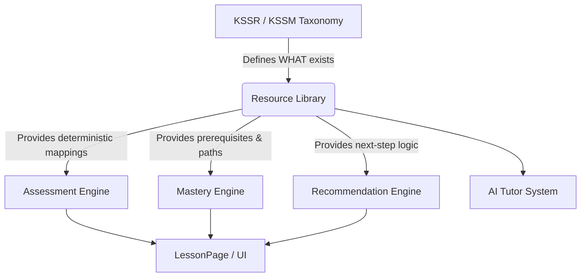

# StudyQuest Resource Library Architecture

The Resource Library is the permanent foundation of the StudyQuest platform. It acts as the central, UI-independent data layer that connects the theoretical KSSR/KSSM Taxonomy to the actual interactive modules, assessments, and AI Tutor engines.

## 1. Architecture Diagram



## 2. JSON Schema Explanation

The schema is strictly structured around the Standard Pembelajaran (SP) code. Every SP is treated as an isolated "knowledge node".

- **Core Details**: `sp_code`, `title`, `description`, `subject`, `grade`.
- **Pedagogical Constraints**: `learning_objectives`, `success_criteria`, `difficulty`, `bloom_level`, `estimated_duration`.
- **Mastery Config**: `mastery_threshold` (e.g., 80%), `prerequisites`, `recommended_next`, `recommended_revision`.
- **Foreign Keys / Resolvers**:
  - `lesson_ids`, `lesson_version_ids`, `lesson_block_ids` (Maps to Base44 DB)
  - `assessment_ids`, `quiz_ids` (Maps to Assessments)
  - `widget_ids` (Maps to React Interactive Widgets)
  - `video_ids`, `audio_ids` (Media Assets)
  - `vocabulary_ids`, `hint_ids`, `common_mistakes` (AI Tutor context)

## 3. Example SP Payload

```json
{
  "sp_code": "1.4.1",
  "subject": "Matematik",
  "grade": "Tahun 1",
  "title": "Menyatakan nilai tempat dan nilai digit",
  "mastery_threshold": 80,
  "prerequisites": ["1.1.1"],
  "lesson_ids": ["lsn_mat_141_01"],
  "widget_ids": ["wdg_base_ten_blocks"],
  "vocabulary_ids": ["voc_nilai_tempat", "voc_sa", "voc_puluh"]
}
```

## 4. Service API (`resourceLibraryService.js`)

A highly optimized service layer exposes strict, deterministic helper functions.

**Lookup Helpers**:
- `getResourceBySP(spCode)`: Returns the entire node.

**Relationship Resolvers**:
- `getLessons(spCode)`
- `getLessonVersions(spCode)`
- `getLessonBlocks(spCode)`
- `getAssessments(spCode)`
- `getQuizzes(spCode)`
- `getWidgets(spCode)`
- `getRevision(spCode)`
- `getVideos(spCode)`
- `getAudio(spCode)`
- `getVocabulary(spCode)`
- `getHints(spCode)`

**Pedagogy Resolvers**:
- `getObjectives(spCode)`
- `getSuccessCriteria(spCode)`
- `getMasteryThreshold(spCode)`
- `getPrerequisites(spCode)`
- `getRecommendedNext(spCode)`
- `getRecommendedRevision(spCode)`

**Search Utilities**:
- `searchResources(keyword)`
- `getResourcesBySubject(subject)`
- `getResourcesByYear(year)`
- `getResourcesByBloomLevel(level)`

## 5. Future Integrations

The Resource Library is purely foundational. It will eventually power:
1. **Assessment Engine**: To generate dynamic tests pulling from `quiz_ids`.
2. **Mastery Engine**: To track student performance against the `mastery_threshold`.
3. **Recommendation Engine**: To autonomously route struggling students to `recommended_revision` or advanced students to `recommended_next`.
4. **AI Tutor**: To inject `common_mistakes` and `hint_ids` into the LLM context automatically during a lesson.

## 6. Developer Usage Examples

```javascript
import { getWidgets, getPrerequisites, getMasteryThreshold } from '@/services/resourceLibraryService';

// 1. Instantly know which widget powers this SP without checking the DB:
const requiredWidgets = getWidgets('1.4.1'); 
// Output: ["wdg_base_ten_blocks"]

// 2. Prevent a student from starting an SP if prerequisites aren't met:
const prerequisites = getPrerequisites('1.4.2');
// Output: ["1.4.1"]

// 3. Define the passing grade for dynamic PBD assessments:
const passingScore = getMasteryThreshold('2.1.1');
// Output: 75
```
