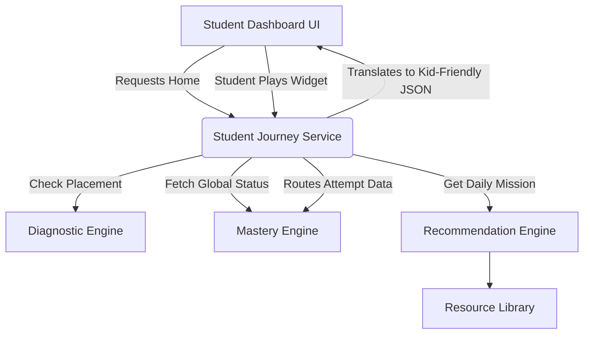

# StudyQuest Student Learning Experience Layer

The Student Journey Service bridges the hardcore analytical backends (Mastery Engine, Recommendation Engine, Resource Library) to a child-friendly, gamified UI payload. 

Children should never see backend algorithms, strict DSKP SP codes, or taxonomy arrays. They only see **Missions, Progress, and XP**.

## 1. Architecture Flow



## 2. Core Philosophy

- **Zero Friction**: A student opens the app and is handed exactly ONE thing to do (`getTodayMission()`).
- **No Manual Searching**: The recommendation engine safely paths them forward, or dynamically paths them backward to revise without the student knowing they failed a prerequisite.
- **Immediate Gamification**: Interactions yield XP and Streak counts instantly.

## 3. Service API (`studentJourneyService.js`)

### Initialization & State
- `initializeStudentJourney()`: Evaluates if a student requires a Diagnostic Assessment or is ready to hit the dashboard.
- `getStudentHome()`: Generates the master payload for the Student Home dashboard (summarizes mastery, weak/strong areas, and today's mission).

### Mission Execution Loop
- `getTodayMission()`: Formats the top-priority recommendation into a gamified "Cabaran Hari Ini" card.
- `startMission()`: Begins session tracking.
- `recordMissionResult()`: Passes the widget/quiz attempts down into the Mastery Engine.
- `completeMission()`: Finalizes the session, evaluates mastery status, and returns UI celebration data (XP, Badges).

### Meta & Parent Support
- `getNextAction()`: Predicts where the UI router should send the student.
- `getStudySummary()`: Translates raw data into a Parent-friendly support report (e.g., "Bantu anak anda mengulangkaji topik pecahan").

## 4. Example Usage

```javascript
import { getStudentHome, startMission, recordMissionResult, completeMission } from '@/services/studentJourneyService';

// 1. Dashboard loads for a Tahun 1 student
const homeData = getStudentHome('stud_789', 'Amir', 'KSSR_SEMAKAN', 'Tahun 1', 'Matematik');
/*
  UI renders cleanly:
  "Selamat kembali Amir! Misi hari ini: Kuasai Nilai Tempat (1.4.1)"
*/

// 2. Student clicks "Mula Misi"
startMission('stud_789', homeData.todayMission);

// 3. Student plays the BaseTenBlocks widget
recordMissionResult('stud_789', true, 45); // Sent to Mastery Engine

// 4. Mission finishes
const result = completeMission('stud_789');
/*
  Returns: { earnedXp: 50, newStatus: "MASTERED", confidence: "HIGH" }
  UI triggers Confetti!
*/
```

## 5. Future Integration Points

This layer is specifically designed to feed:
1. **Student Dashboard (`Home.jsx`)**: Will directly consume `getStudentHome()`.
2. **Mission Studio (`LessonPage.jsx`)**: The UI I just built will be wrapped by the `startMission` and `completeMission` flows.
3. **Parent App**: Will consume `getStudySummary()` to generate weekly email reports.
